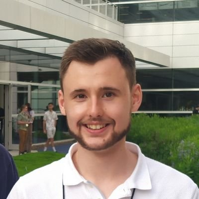

Owain Parry is a Research Associate in the Department of Computer Science at the [University of Sheffield](https://www.sheffield.ac.uk/dcs). He received his PhD in 2023 with a thesis on flaky tests titled *Understanding and Mitigating Flaky Software Test Cases*, supervised by [Phil McMinn](https://mcminn.info/). Owain is currently working on the EPSRC-funded Test FLARE (Test Flakiness Automated Reproduction and Explanation) project, which will develop and empirically evaluate techniques capable of automatically reproducing flaky behaviour that is due to the execution environment. It will also provide developers with automated, human-readable explanations to reveal the reasons for the flaky behaviour. Beyond flaky tests, Owain's research interests include: automatic test generation, quantum computing, machine learning, and search-based software engineering. [Contact me](mailto:o.b.parry+homepage@sheffield.ac.uk).

## Publications

### 2024

- M. Gruber, M. F. Roslan, O. Parry, F. Scharnböck, P. McMinn, and G. Fraser. Do Automatic Test Generation Tools Generate Flaky Tests? In Proceedings of the International Conference on Software Engineering (ICSE), to appear, 2024.

### 2023

- O. Parry, G. M. Kapfhammer, M. Hilton, and P. McMinn. Empirically evaluating flaky test detection techniques combining test case rerunning and machine learning
models. Empirical Software Engineering, 28(72), 2023.

### 2022

- O. Parry, G. M. Kapfhammer, M. Hilton, and P. McMinn. What do developer-repaired flaky tests tell us about the effectiveness of automated flaky test detection? In Proceedings of the International Conference on Automation of Software Test (AST), pages 160–164, 2022.
- O. Parry, G. M. Kapfhammer, M. Hilton, and P. McMinn. Surveying the developer experience of flaky tests. In Proceedings of the International Conference on Software Engineering: Software Engineering in Practice (ICSE-SEIP), pages 253–262, 2022.
- O. Parry, G. M. Kapfhammer, M. Hilton, and P. McMinn. Evaluating features for machine learning detection of order- and non-order-dependent flaky tests. In Proceedings of the International Conference on Software Testing, Verification and Validation (ICST), pages 93–104, 2022.

### 2021

- O. Parry, G. M. Kapfhammer, M. Hilton, and P. McMinn. A survey of flaky tests. Transactions on Software Engineering and Methodology, 31(1):1–74, 2021.

### 2020

- O. Parry, G. M. Kapfhammer, M. Hilton, and P. McMinn. Flake it ‘till you make it: Using automated repair to induce and fix latent test flakiness. In Proceedings of the International Workshop on Automated Program Repair (APR), pages 11–12, 2020.

## Teaching

During his time as a PhD student, Owain work as a Graduate Teaching Assistant at the University of Sheffield. His duties included supporting lab sessions, marking assignments, and delivering seminars to undergraduate students on the following modules:

- [COM1001 Introduction to Software Engineering](https://www.dcs.shef.ac.uk/intranet/teaching/public/modules/level1/com1001.html)
- [COM2107 Logic in Computer Science](https://www.dcs.shef.ac.uk/intranet/teaching/public/modules/level2/com2107.html)
- [COM2109 Automata, Computation and Complexity](https://www.dcs.shef.ac.uk/intranet/teaching/public/modules/level2/com2109.html)
- [COM3529 Software Testing and Analysis](https://www.dcs.shef.ac.uk/intranet/teaching/public/modules/level3/com3529.html)

## Service

Throughout his research career, Owain has served the software engineering research community in the following ways:

- Reviewer for [Software Testing, Verification Reliability](https://onlinelibrary.wiley.com/journal/10991689).
- Reviewer for [Information and Software Technology](https://www.sciencedirect.com/journal/information-and-software-technology).
- Student volunteer at the [International Conference on Software Engineering 2022](https://conf.researchr.org/home/icse-2022).
- Student volunteer at the [International Conference on Software Testing, Verification and Validation 2023](https://conf.researchr.org/home/icst-2023).
- Session chair at the [International Conference on Automation of Software Test 2022](https://conf.researchr.org/home/ast-2022).
- Program committee chair for the [International Flaky Tests Workshop 2024](https://conf.researchr.org/home/icse-2024/ftw-2024).

## Media Appearances

- Guest on [Talk Python Podcast](https://talkpython.fm/), episode [Taming Flaky Tests](https://talkpython.fm/episodes/show/429/taming-flaky-tests).
- Featured on [departmental blog](https://www.sheffield.ac.uk/dcs/news), article [Researchers find new hope through machine learning for dreaded ‘flaky test’](https://www.sheffield.ac.uk/dcs/news/researchers-find-new-hope-through-machine-learning-dreaded-flaky-test).
- Featured on [Engineering Enablement](https://newsletter.getdx.com/), article [How Flaky Tests Impact Developers](https://newsletter.getdx.com/p/flaky-tests).